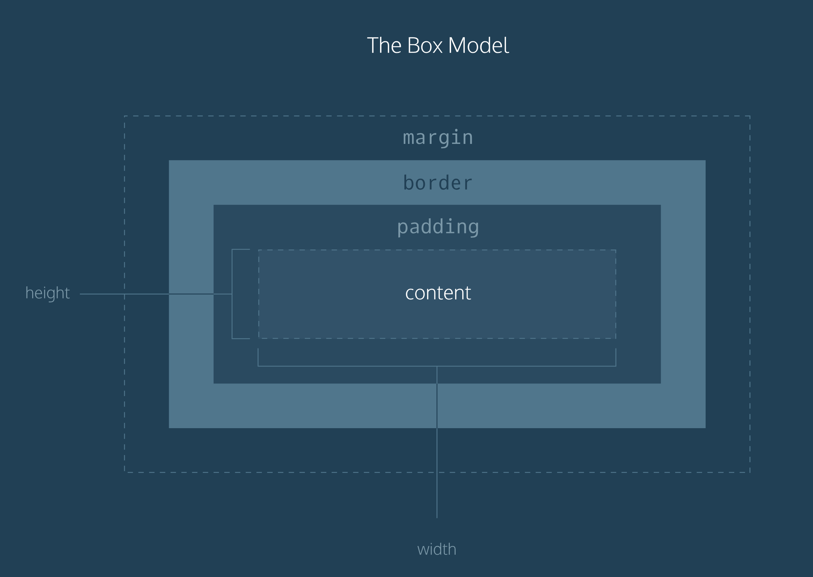

# CSS Codeacademy Intro Notes Pt.1

## Structure and Assignment

- Link CSS file inside <head> with <link href="style.css" type="text/css" rel="stylesheet">
- Specificity is the order by which the browser decides which CSS styles will be displayed. A best practice in CSS is to style elements while using the lowest degree of specificity, so that if an element needs a new style, it is easy to override.
- IDs are the most specific selector in CSS, followed by classes, and finally, tags. For example, consider the following HTML and CSS:
- The only way to override an ID is to add another ID with additional styling.
- To make styles easy to edit, it's best to style with a tag selector, if possible. If not, add a class selector. If that is not specific enough, then consider using an ID selector.
- Adding more than one tag, class, or ID to a CSS selector increases the specificity of the CSS selector.
- There is one thing that is even more specific than IDs: !important. !important can be applied to specific attributes instead of full rules. It will override any style no matter how specific it is. As a result, it should almost never be used. Once !important is used, it is very hard to override.
- The syntax of `!important` in CSS looks like this:

    p {
      color: blue !important;
    }
    
    
    .main p {
      color: red;
    }

- CSS can change the look of HTML elements. In order to do this, CSS must select HTML elements, then apply styles to them.
- CSS can select HTML elements by tag, class, or ID.
- Multiple CSS classes can be applied to one HTML element.
- Classes can be reusable, while IDs can only be used once.
- IDs are more specific than classes, and classes are more specific than tags. That means IDs will override any styles from a class, and classes will override any styles from a tag selector.
- Multiple selectors can be chained together to select an element. This raises the specificity, but can be necessary.
- Nested elements can be selected by separating selectors with a space.
- The `!important` flag will override any style, however it should almost never be used, as it is extremely difficult to override.
- Multiple unrelated selectors can receive the same styles by separating the selector names with commas.
- h1 {
  color: blue;
}

The example above selects the `<h1>` element. Inside of the selector's body, we typed `color: blue`. This line is referred to as a CSS *declaration*. CSS declarations consist of a *property* and a *value*.

- Property — the property you'd like to style of that element (i.e., size, color, etc.).
- Value — the value of the property (i.e., 18px for size, blue for color, etc.).
1. The font specified in a stylesheet must be installed on a user's computer in order for that font to display when a user visits the web page.
2. The default typeface for all HTML elements is `Times New Roman`. You may be familiar with this typeface if you have ever used a formatted word processor. If no `font-family` attribute is defined, the page will appear in `Times New Roman`.
3. It's a good practice to limit the number of typefaces used on a web page to 2 or 3. This helps the page load faster in some cases and is usually a good design decision.
4. When the name of a typeface consists of more than one word, it's a best practice to enclose the typeface's name in quotes, like so:
- CSS declarations are structured into property and value pairs.
- The `font-family` property defines the typeface of an element.
- `font-size` controls the size of text displayed.
- `font-weight` defines how thin or thick text is displayed.
- The `text-align` property places text in the left, right, or center of its parent container.
- Text can have two different color attributes: `color` and `background-color`. `color` defines the color of the text, while `background-color`defines the color behind the text.
- CSS can make an element transparent with the `opacity` property.
- CSS can also set the background of an element to an image with the `background-image` property.

## The Box Model

A *border* is a line that surrounds an element, like a frame around a painting. Borders can be set with a specific `width`, `style`, and `color`.

1. `width` — The thickness of the border. A border's thickness can be set in pixels or with one of the following keywords: `thin`, `medium`, or `thick`.
2. `style` — The design of the border. Web browsers can render any of [10 different styles](https://developer.mozilla.org/en-US/docs/Web/CSS/border-style#Values). Some of these styles include: `none`, `dotted`, and `solid`.
3. `color` — The color of the border. Web browsers can render colors using a few different formats, including [140 built-in color keywords](https://developer.mozilla.org/en-US/docs/Web/CSS/color_value).
- Padding is space added inside an element's border, while margin is space added outside an element's border. One additional difference is that top and bottom margins, also called vertical margins, collapse, while top and bottom padding does not.
- Unlike horizontal margins, vertical margins do not add. Instead, the larger of the two vertical margins sets the distance between adjacent elements.

CSS offers two properties that can limit how narrow or how wide an element's box can be sized to.

1. `min-width` — this property ensures a minimum width of an element's box.
2. `max-width` — this property ensures a maximum width of an element's box.

The `overflow` property controls what happens to content that spills, or overflows, outside its box. It can be set to one of the following values:

- `hidden` - when set to this value, any content that overflows will be hidden from view.
- `scroll` - when set to this value, a scrollbar will be added to the element's box so that the rest of the content can be viewed by scrolling.
- `visible` - when set to this value, the overflow content will be displayed outside of the containing element. Note, this is the default value.

    * {
      margin: 0;
      padding: 0;
    }

The code in the example above resets the default margin and padding values of all HTML elements. It is often the first CSS rule in an external stylesheet.

1. The box model comprises a set of properties used to create space around and between HTML elements.
2. The height and width of a content area can be set in pixels or percentage.
3. Borders surround the content area and padding of an element. The color, style, and thickness of a border can be set with CSS properties.
4. Padding is the space between the content area and the border. It can be set in pixels or percent.
5. Margin is the amount of spacing outside of an element's border.
6. Horizontal margins add, so the total space between the borders of adjacent elements is equal to the sum of the right margin of one element and the left margin of the adjacent element.
7. Vertical margins collapse, so the space between vertically adjacent elements is equal to the larger margin.
8. `margin: 0 auto` horizontally centers an element inside of its parent content area, if it has a width.
9. The `overflow` property can be set to `display`, `hide`, or `scroll`, and dictates how HTML will render content that overflows its parent's content area.
10. The `visibility` property can hide or show elements.
- * { box-sizing: border-box;
}

The code in the example above resets the box model to border-box for all HTML elements. This new box model avoids the dimensional issues that exist in the former box model you learned about.

- The universal selector (*) targets all elements on the web page
1. In the default box model, box dimensions are affected by border thickness and padding.
2. The `box-sizing` property controls the box model used by the browser.
3. The default value of the `box-sizing` property is `content-box`.
4. The value for the new box model is `border-box`.
5. The `border-box` model is not affected by border thickness or padding.

## CSS Display And Positioning

- The default position of an element can be changed by setting its `position` property. The `position` property can take one of four values:
- `static` - the default value (it does not need to be specified)
- `relative`
- `absolute`
- `fixed`
- The z-index property controls how far "back" or how far "forward" an element should appear on the web page when elements overlap. This can be thought of the depth of elements, with deeper elements appearing behind shallower elements.
- Every HTML element has a default display value that dictates if it can share horizontal space with other elements.
- Inline elements cannot be altered in size with the height or width CSS properties.
- Some elements are not displayed in the same line as the content around them. These are called block-level elements. These elements fill the entire width of the page by default, but their width property can also be set.
1. The `position` property allows you to specify the position of an element in three different ways.
2. When set to `relative`, an element's position is relative to its default position on the page.
3. When set to `absolute`, an element's position is relative to its closest positioned parent element. It can be pinned to any part of the web page, but the element will still move with the rest of the document when the page is scrolled.
4. When set to `fixed`, an element's position can be pinned to any part of the web page. The element will remain in view no matter what.
5. The `z-index` of an element specifies how far back or how far forward an element appears on the page when it overlaps other elements.
6. The `display` property allows you control how an element flows vertically and horizontally a document.
7. `inline` elements take up as little space as possible, and they cannot have manually-adjusted `width` or `height`.
8. `block` elements take up the width of their container and can have manually-adjusted `height`s.
9. `inline-block` elements can have set `width` and `height`, but they can also appear next to each other and do not take up their entire container width.
10. The `float` property can move elements as far left or as far right as possible on a web page.
11. You can clear an element's left or right side (or both) using the `clear`property.