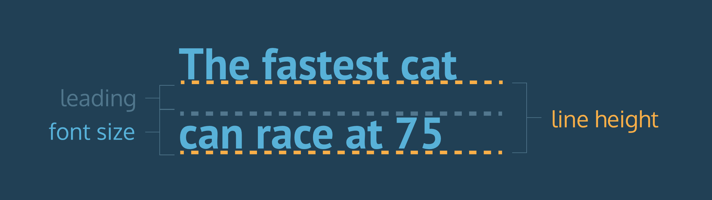

# CSS Codeacademy Intro Notes Pt.2

## Introduction to Color

- CSS supports a wide variety of colors. These include *named colors*, like `blue`, `black`, and `LimeGreen`, along with colors described by a numeric value. Using a numeric system allows us to take advantage of the whole spectrum of colors that browsers support. In this lesson, we're going to explore all the color options CSS offers.
- Colors in CSS can be described in three different ways:
- *Named colors* — English words that describe colors, also called *keyword colors*
- *RGB* — numeric values that describe a mix of red, green, and blue
- *HSL* — numeric values that describe a mix of hue, saturation, and lightness
- To use opacity in the HSL color scheme, use `hsla` instead of `hsl`, and four values instead of three. For example:
- color: hsla(34, 100%, 50%, 0.1);
- The first three values work the same as hsl. The fourth value (which we have not seen before) is the alpha. This last value is sometimes called the opacity.
- Alpha is a decimal number from zero to one. If alpha is zero, the color will be completely transparent. If alpha is one, the color will be opaque. The value for half transparent would be 0.5.

There are four ways to represent color in CSS:

- Named colors — there are 147 named colors, which you can review [here](https://msdn.microsoft.com/en-us/library/aa358802(v=vs.85).aspx).
- Hexadecimal or hex colors
    - Hexadecimal is a number system with has sixteen digits, 0 to 9 followed by "A" to "F".
    - Hex values always begin with `#` and specify values of red, blue and green using hexademical numbers such as `#23F41A`.
- RGB
    - RGB colors use the `rgb()` syntax with one value for red, one value for blue and one value for green.
    - RGB values range from 0 to 255 and look like this: `rgb(7, 210, 50)`.
- HSL
    - HSL stands for hue (the color itself), saturation (the intensity of the color), and lightness (how light or dark a color is).
    - Hue ranges from 0 to 360 and saturation and lightness are both represented as percentages like this: `hsl(200, 20%, 50%)`.
- You can add opacity to color in RGB and HSL by adding a fourth value, `a`, which is represented as a percentage

## Typography

- The font-weight property can also be assigned a number value to style text on a numeric scale ranging from 100 to 900

When using numeric weights, there are a number of default font weights that we can use:

1. `400` is the default `font-weight` of most text.
2. `700` signifies a bold `font-weight`.
3. `300` signifies a light `font-weight`.

The `text-align` property can be set to one of the following three values:

1. `left` - aligns text to the left hand side of the browser.
2. `center` - centers text.
3. `right` - aligns text to the right hand side of the browser.
- Another property that we can set for text is `line-height`. This property modifies the *leading* of text.

The diagram to the right helps illustrate exactly what the terms "leading" and "line height" mean.

We can use the `line-height` property to set how tall we want the line containing our text to be, regardless of the height of the text. Line heights can take one of several values:

1. A unitless number, such as `1.2`. This number is an absolute value that will compute the line height as a ratio of the font size.
2. A number specified by unit, such as `12px`. This number can be any valid CSS unit, such as pixels, percents, ems, or rems.

Generally, the unitless ratio value is the preferred method, since it is responsive and based exclusively on the current font size. In other words, if we change the font size, a unitless `line-height` would automatically readjust, whereas the pixel value would remain static.

- fonts.google.com

There are other ways to link non-user fonts that don't require the use of the `<link>` tag in the HTML document. CSS offers a way to import fonts directly into stylesheets with the `@font-face` property.

To load fonts with the `@font-face` property:

1. Instead of using the font's link in the HTML document, enter the link into the URL bar in the browser.
2. The browser will load the CSS rules. You will need to focus on the rules that are directly labeled as `/* latin */`. Some of the latin rules are on separate lines. You will need each of these.
3. Copy each of the CSS rules labeled latin, and paste the rules from the browser to the top of **style.css**.

It is important to stress the need to copy the `@font-face` rules to the top of the stylesheet for the font to load correctly in the project.

- ^ Paste these at the top of your style sheet
- [https://www.fontsquirrel.com/](https://www.fontsquirrel.com/) - good free fonts
- **Recap:**
- *Typography* is the art of arranging text on a page.
- Text can appear in any number of weights, with the `font-weight`property.
- Text can appear in italics with the `font-style` property.
- The vertical spacing between lines of text can be modified with the `line-height` property.
- *Serif* fonts have extra details on the ends of each letter. *Sans-Serif*fonts do not.
- *Fallback fonts* are used when a certain font is not installed on a user's computer.
- Google Fonts provides free fonts that can be used in an HTML file with the `<link>` tag or the `@font-face` property.
- Local fonts can be added to a document with the `@font-face`property and the path to the font's source.
- The `word-spacing` property changes how far apart individual words are.
- The `letter-spacing` property changes how far apart individual letters are.
- The `text-align` property changes the horizontal alignment of text.

## Introduction to Grids / Native CSS Grid

- To set up a grid, you need to have both a grid container and grid items. The grid container will be a parent element that contains grid items as children and applies overarching styling and positioning to them.
- To turn an HTML element into a grid container, you must set the element's display property to grid (for a block-level grid) or inline-grid (for an inline grid). Then, you can assign other properties to lay out the grid.
- We can define the columns of our grid by using the CSS property `grid-template-columns`. Below is an example of this property in action:

    .grid {
      display: grid;
      width: 500px;
      grid-template-columns: 100px 200px;
    }

- This property creates two changes. First, it defines the number of columns in the grid; in this case, there are two. Second, it sets the width of each column. The first column will be 100 pixels wide and the second column will be 200 pixels wide.
- We can also define the size of our columns as a percentage of the entire grid's width.
- To specify the number and size of the rows, we are going to use the property grid-template-rows
- The property grid-template can replace the previous two CSS properties

    grid-template: 200px 300px / 20% 10% 70%;

- The values after the slash determine the size of each column.
- By using the fr unit, we can define the size of columns and rows as a fraction of the grid's length and width

The properties that define the number of rows and columns in a grid can take a function as a value. `repeat()` is one of these functions. The `repeat()` function was created specifically for CSS Grid.

    .grid {
      display: grid;
      width: 300px;
      grid-template-columns: repeat(3, 100px);
    }

The repeat function will duplicate the specifications for rows or columns a given number of times. In the example above, using the repeat function will make the grid have three columns that are each 100 pixels wide. It is the same as writing:

    grid-template-columns: 100px 100px 100px;

The second parameter of `repeat()` can have multiple values.

    grid-template-columns: repeat(2, 20px 50px)

This code will create four columns where the first and third columns will be 20 pixels wide and the second and fourth will be 50 pixels wide.

- In these situations, you might want to prevent a row or column from getting too big or too small. For example, if you have a 100-pixel wide image in your grid, you probably don't want its column to get thinner than 100 pixels! The `minmax()` function can help us solve this problem.

    .grid {
      display: grid;
      grid-template-columns: 100px minmax(100px, 500px) 100px;
    }

In this example, the first and third columns will always be 100 pixels wide, no matter the size of the grid. The second column, however, will vary in size as the overall grid resizes. The second column will always be between 100 and 500 pixels wide.

The CSS properties `grid-row-gap` and `grid-column-gap` will put blank space between every row and column in the grid.

    .grid {
      display: grid;
      width: 320px;
      grid-template-columns: repeat(3, 1fr);
      grid-column-gap: 10px;
    }

- There is a CSS property grid-gap that can set the row and column gap at the same time. grid-gap: 20px 10px; will set the distance between rows to 20 pixels and the distance between columns to 10 pixels. Unlike other CSS grid properties, this shorthand does not take a / between values! If only one value is given, it will set the column gap and the row gap to that value.
- Using the CSS properties grid-row-start and grid-row-end, we can make single grid items take up multiple rows

    .item { 
    	grid-row-start: 1; 
    	grid-row-end: 3;
    }

- Row grid lines and column grid lines start at 1 and end at a value that is 1 greater than the number of rows or columns the grid has. For example, if a grid has 5 rows, the grid row lines range from 1 to 6. If a grid has 8 columns, the grid row lines range from 1 to 9.

We can use the property `grid-row` as shorthand for `grid-row-start`and `grid-row-end`. The following two code blocks will produce the same output:

    .item {
      grid-row-start: 4;
      grid-row-end: 6;
    }

    .item {
      grid-row: 4 / 6;
    }

- we can use the keyword `span` to start or end a column or row relative to its other end. Look at how `span` is used in the code below:

    .item {
      grid-column: 4 / span 2;
    }

This is telling the `item` element to begin in column four and take up two columns of space. So `item` would occupy columns four and five. It produces the same result as the following code blocks:

    .item {
      grid-column: 4 / 6;
    }

    .item {
      grid-column-start: 4;
      grid-column-end: span 2;
    }

    .item {
      grid-column-start: span 2;
      grid-column-end: 6;
    }

- We can refactor even more using the property `grid-area`. This property will set the starting and ending positions for both the rows and columns of an item.
- .item {
  grid-area: 2 / 3 / 4 / span 5;
}
- `grid-area` takes four values separated by slashes. The order is important! This is how `grid-area` will interpret those values.
- `grid-row-start`
- `grid-column-start`
- `grid-row-end`
- `grid-column-end`

Grid Intro wrap up:

- `grid-template-columns` defines the number and sizes of the columns of the grid
- `grid-template-rows` defines the number and sizes of the rows of the grid
- `grid-template` is a shorthand for defining both `grid-template-columns` and `grid-template-rows` in one line
- `grid-gap` puts blank space between rows and/or columns of the grid
- `grid-row-start` and `grid-row-end` makes elements span certain rows of the grid
- `grid-column-start` and `grid-column-end` makes elements span certain columns of the grid
- `grid-area` is a shorthand for `grid-row-start`, `grid-column-start`, `grid-row-end`, and `grid-column-end`, all in one line
- grid-template-areas

[grid-template-areas](https://developer.mozilla.org/en-US/docs/Web/CSS/grid-template-areas)

## Advanced CSS Grid

- The grid-template-areas property allows you to name sections of your web page to use as values in the grid-row-start, grid-row-end, grid-col-start,grid-col-end, and grid-area properties.
- justify-items is a property that positions grid items along the inline, or row, axis. This means that it positions items from left to right across the web page.

    `justify-items` accepts these values:

- `start` — aligns grid items to the left side of the grid area
- `end` — aligns grid items to the right side of the grid area
- `center` — aligns grid items to the center of the grid area
- `stretch` — stretches all items to fill the grid area

    main {
      display: grid;
      grid-template-columns: repeat(3, 400px);
      justify-items: center;
    }

In the example above, we use `justify-items` to adjust the positioning of some elements on this web page.

1. There is a grid container with three columns that are each 400 pixels wide.
2. The container has three grid items that do not have a specified width.
3. Without setting the `justify-items` property, these elements will span the width of the column they are in (400 pixels).
4. By setting the `justify-items` property to `center`, the `.card
`s will be centered inside of their columns. They will only be as wide as necessary to contain their content (the words Card 1, etc).
5. If we specify a width for the `.card` elements, they will not stretch the width of their column.

    This property is declared on grid containers.

    We can use `justify-content` to position the entire grid along the row axis.

    It accepts these values:

- `start` — aligns the grid to the left side of the grid container
- `end` — aligns the grid to the right side of the grid container
- `center` — centers the grid horizontally in the grid container
- `stretch` — stretches the grid items to increase the size of the grid to expand horizontally across the container
- `space-around` — includes an equal amount of space on each side of a grid element, resulting in double the amount of space between elements as there is before the first and after the last element
- `space-between` — includes an equal amount of space between grid items and no space at either end
- `space-evenly` — places an even amount of space between grid items and at either end.
- `align-items` is a property that positions grid items along the block, or column axis. This means that it positions items from top to bottom.

`align-items` accepts these values:

- `start` — aligns grid items to the top side of the grid area
- `end` — aligns grid items to the bottom side of the grid area
- `center` — aligns grid items to the center of the grid area
- `stretch` — stretches all items to fill the grid area

`align-content` positions the rows along the column axis, or from top to bottom.

It accepts these positional values:

- `start` — aligns the grid to the top of the grid container
- `end` — aligns the grid to the bottom of the grid container
- `center` — centers the grid vertically in the grid container
- `stretch` — stretches the grid items to increase the size of the grid to expand vertically across the container
- `space-around` — includes an equal amount of space on each side of a grid element, resulting in double the amount of space between elements as there is before the first and after the last element
- `space-between` — includes an equal amount of space between grid items and no space at either end
- `space-evenly` — places an even amount of space between grid items and at either end

`justify-self` specifies how an individual element should position itself with respect to the row axis. This property will override `justify-items`for any item on which it is declared.

`align-self` specifies how an individual element should position itself with respect to the column axis. This property will override `align-items`for any item on which it is declared.

They both accept these four properties:

- `start` — positions grid items on the left side/top of the grid area
- `end` — positions grid items on the right side/bottom of the grid area
- `center` — positions grid items on the center of the grid area
- `stretch` — positions grid items to fill the grid area (default)

- The implicit grid is an algorithm built into the specification for CSS Grid that determines default behavior for the placement of elements when there are more than fit into the grid specified by the CSS.

`grid-auto-flow` specifies whether new elements should be added to rows or columns.

`grid-auto-flow` accepts these values:

- `row` — specifies the new elements should fill rows from left to right and create new rows when there are too many elements (default)
- `column` — specifies the new elements should fill columns from top to bottom and create new columns when there are too many elements
- `dense` — this keyword invokes an algorithm that attempts to fill holes earlier in the grid layout if smaller elements are added

You can pair `row` and `column` with `dense`, like this: `grid-auto-flow: row dense;`.

Advanced CSS Grid Wrap Up:

- `grid-template-areas` specifies grid named grid areas
- grid layouts are two-dimensional: they have a row, or inline, axis and a column, or block, axis.
- `justify-items` specifies how individual elements should spread across the row axis
- `justify-content` specifies how groups of elements should spread across the row axis
- `justify-self` specifies how a single element should position itself with respect to the row axis
- `align-items` specifies how individual elements should spread across the column axis
- `align-content` specifies how groups of elements should spread across the column axis
- `align-self` specifies how a single element should position itself with respect to the column axis
- `grid-auto-rows` specifies the height of rows added implicitly to the grid
- `grid-auto-columns` specifies the width of columns added implicitly to the grid
- `grid-auto-flow` specifies in which direction implicit elements should be created